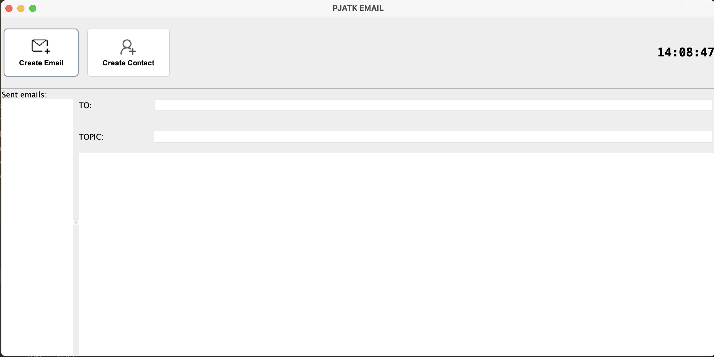
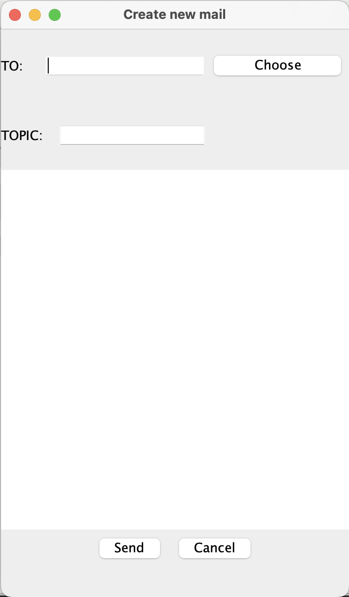

# PJATK Mail
PJATK Mail is a simple email client application built in Java (Maven) using Swing.
It was created as a university project and demonstrates working with GUIs, local file storage, and sending emails via an external library.

## Features:

- Real-time clock displayed on the home window (updates every second).

### 1) Contact management:

- Add new contacts with Name, Surname, and Email.

- Built-in email validation (must contain @ and .).

- Contacts are stored in a local .csv file.

### 2) Send emails:

- Choose a recipient from your contact list.

- Enter subject and message content.

- Emails are sent via the Simple Java Mail library.

- Sent emails are stored in a .csv file.

### 3) History view:

- On the home page, you can see a list of sent emails, including recipients, subjects, and message contents.

## Screenshots

### Home page

### Create Contact

#### Invalid Contact Email

### Send Email

### Sent Email 
